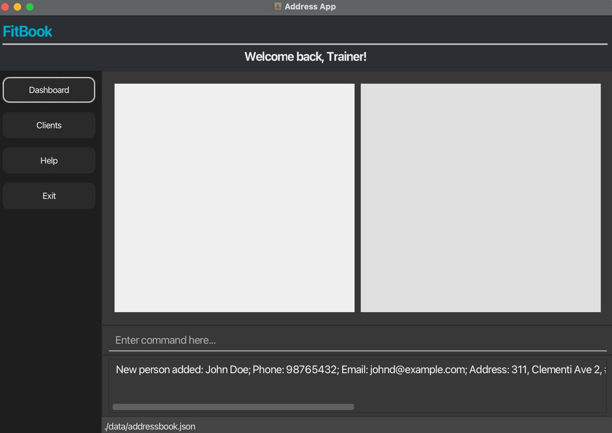

# FitBook User Guide

Hi Trainers! 👋  
**FitBook** is a **desktop app for managing trainees**, optimized for use via a Command Line Interface (CLI) while retaining a modern Graphical User Interface (GUI). Whether you're tech-savvy or new to command-line tools, FitBook’s intuitive commands make it easy to track clients, payments, and progress — all at your fingertips.

**FitBook helps you:**
- **Manage client information** – Store and update trainee contact details, body statistics, and personal data.
- **Track payments** – Monitor payment status and upcoming deadlines.
- **Schedule sessions** – Organize one-off, weekly, biweekly, or monthly training sessions with automatic conflict detection.
- **Track progress** – Record and update height, weight, body fat percentage, age, and gender data over time.
- **Set goals** – Assign and monitor fitness goals with deadlines for each trainee.
- **Organize efficiently** – Use tags to categorize clients and sort lists by payment status or deadlines.



---

## Quick Start

1. Ensure you have **Java 17 or above** installed.
    - **Mac users:** Follow the [installation guide](https://se-education.org/guides/tutorials/javaInstallationMac.html).

2. Download the latest `.jar` file from your team’s [GitHub Releases](https://github.com/AY2526S1-CS2103T-F09-4/tp/releases).

3. Copy the `.jar` file to any folder — this will serve as your **FitBook home folder**.

4. Open a terminal and run:
   ```bash
   java -jar FitBook.jar
   ```
   The GUI should appear within a few seconds. Sample data will be pre-loaded.

5. Try these example commands:
    - `list` – Lists all clients
    - `add n/John Doe p/98765432 e/johnd@example.com a/John street, block 123, #01-01`
    - `delete 3` – Deletes the 3rd client in the list
    - `help` – Opens the help window
    - `exit` – Exits the application

6. Refer to the [Command Reference](#command-reference) below for full details.

---

## Command Reference

This section lists all available commands and how to use them.

> **Format conventions**
> - Words in `UPPER_CASE` are parameters you should replace with your own values.
> - Items in `[square brackets]` are optional.
> - Items followed by `…` can be repeated multiple times.
> - Commands that update trainees use the `INDEX` from the displayed list (starting at 1).
> - Prefixes such as `n/` for name let you provide parameters in **any order**.

---

### `add` — Add a trainee

**Format:**
```
add n/NAME p/PHONE e/EMAIL a/ADDRESS dl/DEADLINE paid/PAID s/SCHEDULE [goal/GOAL] [h/HEIGHT] [w/WEIGHT] [age/AGE] [g/GENDER] [bf/BODYFAT] [t/TAG]…
```

**Example:**
```
add n/John Doe p/98765432 e/johnd@example.com a/311, Clementi Ave 2, #02-25 h/170 w/70 age/25 g/male dl/2025-11-10 paid/false bf/18.5 goal/Build muscle t/friend t/owesMoney
```

**Guidance:**
- Required prefixes: `n/`, `p/`, `e/`, `a/`, `dl/`, `paid/`, `s/`
- Optional: `goal/`, `h/`, `w/`, `age/`, `g/`, `bf/`, `t/`
- Units: height (cm), weight (kg), age (years), body fat (%)
- `GENDER` accepts: `male`, `female`, `other`, `non-binary`, `prefer not to say`
- `PAID` accepts `true` or `false`
- `DEADLINE` format: `yyyy-MM-dd`
- Automatically saves data after successful addition

---

### `edit` — Edit a trainee

**Format:**
```
edit INDEX [n/NAME] [p/PHONE] [e/EMAIL] [a/ADDRESS] [h/HEIGHT] [w/WEIGHT] [age/AGE] [g/GENDER] [dl/DEADLINE] [paid/PAID] [bf/BODYFAT] [goal/GOAL] [t/TAG]…
```

**Example:**
```
edit 2 p/91234567 e/alex@example.com goal/Run a half marathon
```

**Guidance:**
- Provide at least one field to update.
- When specifying tags, existing tags are replaced with the new ones.
- Automatically saves changes after editing.

---

### `list` — View all trainees
**Format:** `list`  
Displays the entire trainee list.

---

### `find` — Search trainees by name
**Format:** `find KEYWORD [MORE_KEYWORDS]…`  
**Example:** `find alex bernice`

**Guidance:**
- Case-insensitive search within names
- Multiple keywords perform an OR-search (matches if any keyword is present)
- Only full words will be matched e.g. `Han` will not match `Hans`

---

### `delete` — Remove a trainee
**Format:** `delete INDEX`  
**Example:** `delete 3`

Deletes the trainee at the given index in the displayed list.

---

### `clear` — Delete all trainees
**Format:** `clear`  
⚠️ This action cannot be undone.

---

### `sortbypaid` — Sort trainees by payment status
**Format:** `sortbypaid`
- Unpaid trainees (paid:`false`) appear first.
- Paid trainees (paid:`true`) appear last.

---

### `sortbydeadline` — Sort trainees by payment deadline
**Format:** `sortbydeadline [asc/desc]`  
**Examples:**
- `sortbydeadline` → ascending
- `sortbydeadline desc` → descending

**Guidance:**
- Ascending: earliest → latest → no deadline
- Descending: no deadline → latest → earliest

---

### `session` — Update a trainee’s scheduled session
**Format:** `session INDEX s/SESSION`  
**Example:** `session 1 s/WEEKLY:MON-1800-1930`

FitBook automatically detects and rejects conflicting session timings.

| **Type** | **Format** | **Example** |
|-----------|-------------|-------------|
| **One-off** | `YYYY-MM-DD HH:MM` | `2025-06-10 14:30` |
| **Weekly (single slot)** | `WEEKLY:DAY-START-END` | `weekly:mon-1800-1930` |
| **Weekly (multi-slot)** | `WEEKLY:DAY-START-END-DAY-START-END` | `weekly:mon-1800-1930-tue-1800-1900` |
| **Biweekly** | `BIWEEKLY:DAY-START-END` | `biweekly:fri-0900-1030` |
| **Monthly** | `MONTHLY:DD HH:MM` | `monthly:15 10:00` |

- `DAY` accepts: mon, tue, wed, thu, fri, sat, sun
- Time uses 24-hour format (`HHmm` or `HH:MM`)
- Multi-slot sessions list multiple day–time ranges sequentially
- All times are interpreted in local time

---

### `goal` — Set or clear a fitness goal
**Format:** `goal INDEX goal/GOAL`  
**Example:** `goal 1 goal/Complete a triathlon`  
Use `goal/` with no text to clear the goal.

---

### `deadline` — Update a goal deadline
**Format:** `deadline INDEX dl/DATE`  
**Example:** `deadline 4 dl/2025-12-31`

---

### `paid` — Record payment status
**Format:** `paid INDEX paid/STATUS`  
**Example:** `paid 3 paid/true`

Use `true` if the trainee has paid, or `false` otherwise.

---

### `height`, `weight`, `age`, `bodyfat`, `gender` — Update individual attributes
Each of these commands updates one attribute using the same format:
```
<attribute> INDEX prefix/VALUE
```
Examples:
- `height 2 h/168`
- `weight 2 w/68.5`
- `age 1 age/26`
- `bodyfat 1 bf/17.2`
- `gender 5 g/non-binary`

---

### `client` — Switch to client list view
**Format:** `client`

---

### `dashboard` — Switch to dashboard view
**Format:** `dashboard`

---

### `help` — Open help window
**Format:** `help`  
Displays available commands and tips.

---

### `exit` — Close the program
**Format:** `exit`

---

## Data Handling

### Saving data
FitBook automatically saves all data to the hard disk after any command that changes data. No manual save is required.

### Data file location
Data is stored at:
```
[JAR file location]/data/FitBook.json
```

### Editing data manually
Advanced users may edit the JSON file directly.  
⚠️ Invalid edits (e.g. malformed JSON) will cause FitBook to start with an empty dataset. Always back up before editing.

---

## FAQ

**Q:** How do I transfer my data to another computer?  
**A:** Copy the entire FitBook home folder (including the `data` folder) to the other computer and run the same `.jar` file there.

---

## Known Issues

1. **Multiple screens:**  
   If you move the app to a secondary monitor and later use only one screen, FitBook may reopen off-screen.  
   **Fix:** Delete `preferences.json` before relaunching.

2. **Minimized Help window:**  
   If you minimize the Help window and run `help` again, the existing window stays minimized.  
   **Fix:** Manually restore it from your taskbar.

---

## Appendix: Session Formatting Guide 

See the [session](#session--update-a-trainees-scheduled-session) command above for details.

---

*End of User Guide.*
